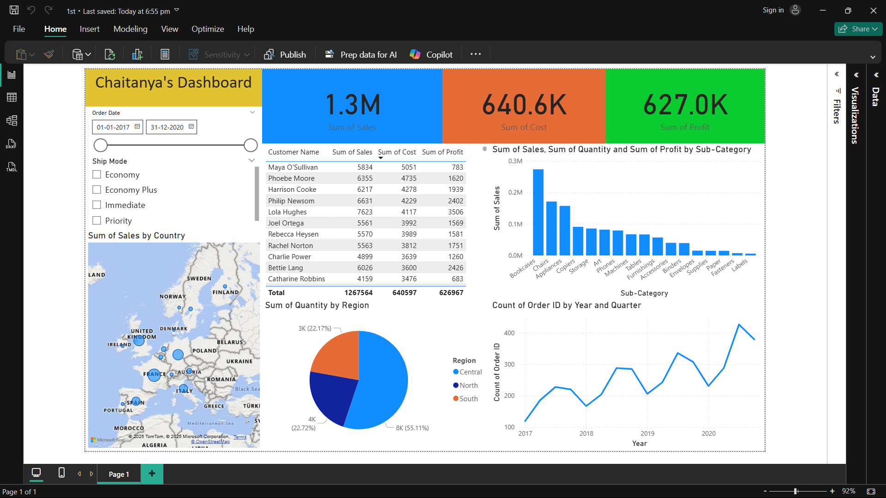

# Power BI Sales Dashboard

This repository contains an interactive **Power BI Dashboard** built using the provided dataset.  
It is designed to give quick, visual insights into key performance metrics.

---

## 📂 Files in This Repository
- **`1st.pbix`** – The Power BI report file containing visualizations, measures, and data modeling.
- **`Power BI Dataset.xlsx`** – The dataset used for building and powering the dashboard.

---

## 📊 Features
- Dynamic charts and KPIs
- Interactive filtering and slicers
- Aggregated summaries and trend analysis
- Custom measures for deeper insights

---

## 🛠 Requirements
To view or edit the dashboard:
- [Power BI Desktop](https://powerbi.microsoft.com/desktop/) (latest version recommended)
- Microsoft Excel (if you want to explore or update the dataset)

---

## 🚀 How to Use
1. **Clone or download** this repository.
2. Open `1st.pbix` in **Power BI Desktop**.
3. Ensure `Power BI Dataset.xlsx` is in the same directory, so the report can locate it.
4. Explore the dashboard by interacting with charts, filters, and slicers.

---

## 🖼 Dashboard Preview
Here are some screenshots of the dashboard:

> 💡 Save your screenshot in the root of your repository using the same filename above.

---

## 📈 Customization
- To update data, edit `Power BI Dataset.xlsx` and refresh the Power BI report.
- You can add new visuals or modify existing ones inside the `.pbix` file.

---

## 🤝 Contributing
Contributions are welcome!  
If you want to improve visuals, add new datasets, or optimize the data model:
1. Fork this repository.
2. Make your changes.
3. Create a Pull Request.

---

## 📜 License
This project does not currently include an open-source license.  
All rights are reserved. Please contact the author for permission before using, modifying, or distributing this work.

---

**Author:** *Chaitanya Sandeep Kolhe*  
**Contact:** *chaitanyakolhe2004@gmail.com*
